my_model
================
Ruixi Li
2023-12-01

### Problem 1

In the data cleaning code below we create a `city_state` variable,
change `victim_age` to numeric, modifiy victim_race to have categories
white and non-white, with white as the reference category, and create a
`resolution` variable indicating whether the homicide is solved. Lastly,
we filtered out the following cities: Tulsa, AL; Dallas, TX; Phoenix,
AZ; and Kansas City, MO; and we retained only the variables
`city_state`, `resolution`, `victim_age`, `victim_sex`, and
`victim_race`.

``` r
homicide_df = 
  read_csv("data/homicide-data.csv", na = c("", "NA", "Unknown")) |> 
  mutate(
    city_state = str_c(city, state, sep = ", "),
    victim_age = as.numeric(victim_age),
    resolution = case_when(
      disposition == "Closed without arrest" ~ 0,
      disposition == "Open/No arrest"        ~ 0,
      disposition == "Closed by arrest"      ~ 1)
  ) |> 
  filter(victim_race %in% c("White", "Black")) |> 
  filter(!(city_state %in% c("Tulsa, AL", "Dallas, TX", "Phoenix, AZ", "Kansas City, MO"))) |> 
  select(city_state, resolution, victim_age, victim_sex, victim_race)
```

    ## Rows: 52179 Columns: 12
    ## ── Column specification ────────────────────────────────────────────────────────
    ## Delimiter: ","
    ## chr (8): uid, victim_last, victim_first, victim_race, victim_sex, city, stat...
    ## dbl (4): reported_date, victim_age, lat, lon
    ## 
    ## ℹ Use `spec()` to retrieve the full column specification for this data.
    ## ℹ Specify the column types or set `show_col_types = FALSE` to quiet this message.

Next we fit a logistic regression model using only data from Baltimore,
MD. We model `resolved` as the outcome and `victim_age`, `victim_sex`,
and `victim_race` as predictors. We save the output as `baltimore_glm`
so that we can apply `broom::tidy` to this object and obtain the
estimate and confidence interval of the adjusted odds ratio for solving
homicides comparing non-white victims to white victims.

``` r
baltimore_glm = 
  filter(homicide_df, city_state == "Baltimore, MD") |> 
  glm(resolution ~ victim_age + victim_sex + victim_race, family = binomial(), data = _)

baltimore_glm |> 
  broom::tidy() |> 
  mutate(
    OR = exp(estimate), 
    OR_CI_upper = exp(estimate + 1.96 * std.error),
    OR_CI_lower = exp(estimate - 1.96 * std.error)) |> 
  filter(term == "victim_sexMale") |> 
  select(OR, OR_CI_lower, OR_CI_upper) |>
  knitr::kable(digits = 3)
```

|    OR | OR_CI_lower | OR_CI_upper |
|------:|------------:|------------:|
| 0.426 |       0.325 |       0.558 |

Below, by incorporating `nest()`, `map()`, and `unnest()` into the
preceding Baltimore-specific code, we fit a model for each of the
cities, and extract the adjusted odds ratio (and CI) for solving
homicides comparing non-white victims to white victims. We show the
first 5 rows of the resulting dataframe of model results.

``` r
model_results = 
  homicide_df |> 
  nest(data = -city_state) |> 
  mutate(
    models = map(data, \(df) glm(resolution ~ victim_age + victim_sex + victim_race, 
                             family = binomial(), data = df)),
    tidy_models = map(models, broom::tidy)) |> 
  select(-models, -data) |> 
  unnest(cols = tidy_models) |> 
  mutate(
    OR = exp(estimate), 
    OR_CI_upper = exp(estimate + 1.96 * std.error),
    OR_CI_lower = exp(estimate - 1.96 * std.error)) |> 
  filter(term == "victim_sexMale") |> 
  select(city_state, OR, OR_CI_lower, OR_CI_upper)


model_results |>
  slice(1:5) |> 
  knitr::kable(digits = 3)
```

| city_state      |    OR | OR_CI_lower | OR_CI_upper |
|:----------------|------:|------------:|------------:|
| Albuquerque, NM | 1.767 |       0.831 |       3.761 |
| Atlanta, GA     | 1.000 |       0.684 |       1.463 |
| Baltimore, MD   | 0.426 |       0.325 |       0.558 |
| Baton Rouge, LA | 0.381 |       0.209 |       0.695 |
| Birmingham, AL  | 0.870 |       0.574 |       1.318 |

Below we generate a plot of the estimated ORs and CIs for each city,
ordered by magnitude of the OR from smallest to largest. From this plot
we see that most cities have odds ratios that are smaller than 1,
suggesting that crimes with male victims have smaller odds of resolution
compared to crimes with female victims after adjusting for victim age
and race. This disparity is strongest in New yrok. In roughly half of
these cities, confidence intervals are narrow and do not contain 1,
suggesting a significant difference in resolution rates by sex after
adjustment for victim age and race.

``` r
model_results |> 
  mutate(city_state = fct_reorder(city_state, OR)) |> 
  ggplot(aes(x = city_state, y = OR)) + 
  geom_point() + 
  geom_errorbar(aes(ymin = OR_CI_lower, ymax = OR_CI_upper)) + 
  theme(axis.text.x = element_text(angle = 90, hjust = 1))
```

<!-- -->

# Problem 2

## load data

``` r
weather_df = 
  rnoaa::meteo_pull_monitors(
    c("USW00094728"),
    var = c("PRCP", "TMIN", "TMAX"), 
    date_min = "2022-01-01",
    date_max = "2022-12-31") |>
  mutate(
    name = recode(id, USW00094728 = "CentralPark_NY"),
    tmin = tmin / 10,
    tmax = tmax / 10) |>
  select(name, id, everything())
```

## create 5000 bootstrap samples

``` r
boot_sample = function(df) {
  sample_frac(df, replace = TRUE)
}

weather_boot_straps = 
  tibble(strap_number = 1:5000) |> 
  mutate(
    strap_sample = map(strap_number, \(i) boot_sample(df = weather_df))
  )
```

## quick check

## get estimates

``` r
bootstrap_results = 
  weather_boot_straps |> 
  mutate(
    models = map(strap_sample, \(df) lm(tmax ~ tmin + prcp, data = df)),
    tidy = map(models, broom::tidy),
    glance = map(models, broom::glance))|> 
  select(-strap_sample, -models) |> 
  unnest(c(tidy,glance), names_repair = "universal") |> 
  select(strap_number,term,r.squared,estimate) |>
  filter(term !="(Intercept)") |>
  group_by(strap_number) |>
        pivot_wider(
    names_from = term,
    values_from = estimate) |>
  mutate(log = log(tmin*prcp)) |>
  select(-tmin,-prcp) |>
  janitor::clean_names()
```

## plot the distribution

``` r
r2_dist = bootstrap_results |>
  ggplot() +
  geom_histogram(aes(x = r_squared), color = "blue") +
  ggtitle("Distribution of R^2")
r2_dist
```

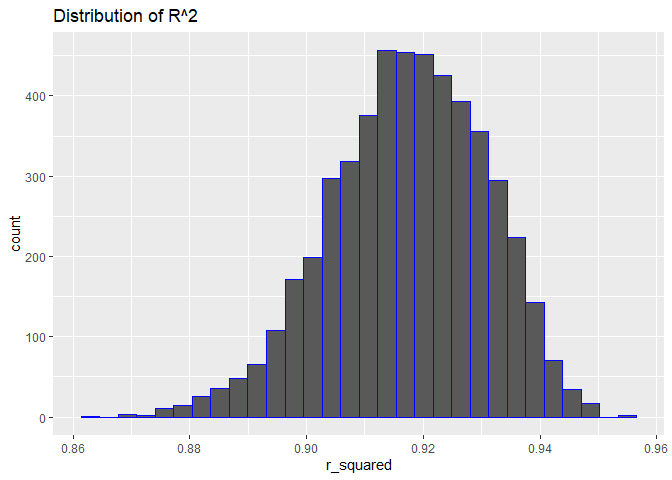<!-- -->

``` r
ggsave("r2_dist.png")

log_dist = bootstrap_results |>
  ggplot() +
  geom_histogram(aes(x = log), color = "red") +
  ggtitle("Distribution of log(beta1*beta2)")
log_dist
```

    ## Warning: Removed 3439 rows containing non-finite values (`stat_bin()`).

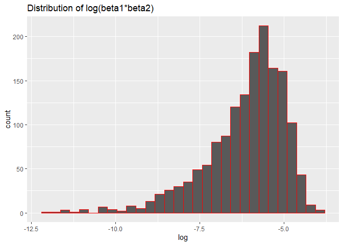<!-- -->

``` r
ggsave("log_dist.png")
```

    ## Warning: Removed 3439 rows containing non-finite values (`stat_bin()`).

Description for the plots:

- r2_dist: the r2 for the 5000 bootstrap samples are approximately
  normally distributed.The mean or mode of r2 falls around 9.1 and the
  variance is not large(most of data locates between 0.87 and 0.95).
  These suggests that a high proportion of variance in the `tmax` can be
  explained by `tmin` and `prcp` included in the model.The relatively
  tight clustering of r2 values also suggests that the underlying data
  are likely to be of high quality with strong linear relationships.

- log_dist: through log transformation, 3288 data (beta1\*beta2\<0) was
  excluded; meanwhile, because beta1Xbeta2 is too small(positive), log
  transformation reduced skewness and made the distribution of this
  product more symmetrical. But the overall distribution is still left
  skewed. most of the data falls around -6.These indicates that for more
  than 3288 samples, `tmin` and `prcp` have opposite effects on `tmax`;
  for 1822 samples, `tmin` and `prcp` have effects on `tmax`in the same
  direction. Absolute of beta2 tend to be very small.

## identify the 2.5% and 97.5% quantiles to provide a 95% confidence interval

``` r
# r2

# get quantiles
quantiles = round(quantile(pull(bootstrap_results,r_squared), probs = c(0.025, 0.975)),2)

# identify the 2.5% and 97.5% quantiles
lower_bound = quantiles[1]  # 2.5% quantile
upper_bound = quantiles[2]  # 97.5% quantile

# paste them to create the 95% Confidence Interval
cat("95% Confidence Interval for r2: [", lower_bound, ", ", upper_bound, "]", sep="")
```

    ## 95% Confidence Interval for r2: [0.89, 0.94]

``` r
# log(b1*b2)

# get quantiles
quantiles2 = round(quantile(pull(bootstrap_results,log), probs = c(0.025, 0.975), na.rm= TRUE),2)

# identify the 2.5% and 97.5% quantiles
lower_bound2 = quantiles2[1]  # 2.5% quantile
upper_bound2 = quantiles2[2]  # 97.5% quantile

# paste them to create the 95% Confidence Interval
cat("95% Confidence Interval for log(beta1*beta2): [", lower_bound2, ", ", upper_bound2, "]", sep="")
```

    ## 95% Confidence Interval for log(beta1*beta2): [-9.03, -4.56]

# Problem 3

## Data cleaning

``` r
bw = read_csv("data/birthweight.csv")
skimr::skim(bw)
```

|                                                  |      |
|:-------------------------------------------------|:-----|
| Name                                             | bw   |
| Number of rows                                   | 4342 |
| Number of columns                                | 20   |
| \_\_\_\_\_\_\_\_\_\_\_\_\_\_\_\_\_\_\_\_\_\_\_   |      |
| Column type frequency:                           |      |
| numeric                                          | 20   |
| \_\_\_\_\_\_\_\_\_\_\_\_\_\_\_\_\_\_\_\_\_\_\_\_ |      |
| Group variables                                  | None |

Data summary

**Variable type: numeric**

| skim_variable | n_missing | complete_rate |    mean |     sd |     p0 |     p25 |     p50 |     p75 |   p100 | hist  |
|:--------------|----------:|--------------:|--------:|-------:|-------:|--------:|--------:|--------:|-------:|:------|
| babysex       |         0 |             1 |    1.49 |   0.50 |   1.00 |    1.00 |    1.00 |    2.00 |    2.0 | ▇▁▁▁▇ |
| bhead         |         0 |             1 |   33.65 |   1.62 |  21.00 |   33.00 |   34.00 |   35.00 |   41.0 | ▁▁▆▇▁ |
| blength       |         0 |             1 |   49.75 |   2.72 |  20.00 |   48.00 |   50.00 |   51.00 |   63.0 | ▁▁▁▇▁ |
| bwt           |         0 |             1 | 3114.40 | 512.15 | 595.00 | 2807.00 | 3132.50 | 3459.00 | 4791.0 | ▁▁▇▇▁ |
| delwt         |         0 |             1 |  145.57 |  22.21 |  86.00 |  131.00 |  143.00 |  157.00 |  334.0 | ▅▇▁▁▁ |
| fincome       |         0 |             1 |   44.11 |  25.98 |   0.00 |   25.00 |   35.00 |   65.00 |   96.0 | ▃▇▅▂▃ |
| frace         |         0 |             1 |    1.66 |   0.85 |   1.00 |    1.00 |    2.00 |    2.00 |    8.0 | ▇▁▁▁▁ |
| gaweeks       |         0 |             1 |   39.43 |   3.15 |  17.70 |   38.30 |   39.90 |   41.10 |   51.3 | ▁▁▂▇▁ |
| malform       |         0 |             1 |    0.00 |   0.06 |   0.00 |    0.00 |    0.00 |    0.00 |    1.0 | ▇▁▁▁▁ |
| menarche      |         0 |             1 |   12.51 |   1.48 |   0.00 |   12.00 |   12.00 |   13.00 |   19.0 | ▁▁▂▇▁ |
| mheight       |         0 |             1 |   63.49 |   2.66 |  48.00 |   62.00 |   63.00 |   65.00 |   77.0 | ▁▁▇▂▁ |
| momage        |         0 |             1 |   20.30 |   3.88 |  12.00 |   18.00 |   20.00 |   22.00 |   44.0 | ▅▇▂▁▁ |
| mrace         |         0 |             1 |    1.63 |   0.77 |   1.00 |    1.00 |    2.00 |    2.00 |    4.0 | ▇▇▁▁▁ |
| parity        |         0 |             1 |    0.00 |   0.10 |   0.00 |    0.00 |    0.00 |    0.00 |    6.0 | ▇▁▁▁▁ |
| pnumlbw       |         0 |             1 |    0.00 |   0.00 |   0.00 |    0.00 |    0.00 |    0.00 |    0.0 | ▁▁▇▁▁ |
| pnumsga       |         0 |             1 |    0.00 |   0.00 |   0.00 |    0.00 |    0.00 |    0.00 |    0.0 | ▁▁▇▁▁ |
| ppbmi         |         0 |             1 |   21.57 |   3.18 |  13.07 |   19.53 |   21.03 |   22.91 |   46.1 | ▃▇▁▁▁ |
| ppwt          |         0 |             1 |  123.49 |  20.16 |  70.00 |  110.00 |  120.00 |  134.00 |  287.0 | ▅▇▁▁▁ |
| smoken        |         0 |             1 |    4.15 |   7.41 |   0.00 |    0.00 |    0.00 |    5.00 |   60.0 | ▇▁▁▁▁ |
| wtgain        |         0 |             1 |   22.08 |  10.94 | -46.00 |   15.00 |   22.00 |   28.00 |   89.0 | ▁▁▇▁▁ |

``` r
str(bw)
```

    ## spc_tbl_ [4,342 × 20] (S3: spec_tbl_df/tbl_df/tbl/data.frame)
    ##  $ babysex : num [1:4342] 2 1 2 1 2 1 2 2 1 1 ...
    ##  $ bhead   : num [1:4342] 34 34 36 34 34 33 33 33 36 33 ...
    ##  $ blength : num [1:4342] 51 48 50 52 52 52 46 49 52 50 ...
    ##  $ bwt     : num [1:4342] 3629 3062 3345 3062 3374 ...
    ##  $ delwt   : num [1:4342] 177 156 148 157 156 129 126 140 146 169 ...
    ##  $ fincome : num [1:4342] 35 65 85 55 5 55 96 5 85 75 ...
    ##  $ frace   : num [1:4342] 1 2 1 1 1 1 2 1 1 2 ...
    ##  $ gaweeks : num [1:4342] 39.9 25.9 39.9 40 41.6 ...
    ##  $ malform : num [1:4342] 0 0 0 0 0 0 0 0 0 0 ...
    ##  $ menarche: num [1:4342] 13 14 12 14 13 12 14 12 11 12 ...
    ##  $ mheight : num [1:4342] 63 65 64 64 66 66 72 62 61 64 ...
    ##  $ momage  : num [1:4342] 36 25 29 18 20 23 29 19 13 19 ...
    ##  $ mrace   : num [1:4342] 1 2 1 1 1 1 2 1 1 2 ...
    ##  $ parity  : num [1:4342] 3 0 0 0 0 0 0 0 0 0 ...
    ##  $ pnumlbw : num [1:4342] 0 0 0 0 0 0 0 0 0 0 ...
    ##  $ pnumsga : num [1:4342] 0 0 0 0 0 0 0 0 0 0 ...
    ##  $ ppbmi   : num [1:4342] 26.3 21.3 23.6 21.8 21 ...
    ##  $ ppwt    : num [1:4342] 148 128 137 127 130 115 105 119 105 145 ...
    ##  $ smoken  : num [1:4342] 0 0 1 10 1 0 0 0 0 4 ...
    ##  $ wtgain  : num [1:4342] 29 28 11 30 26 14 21 21 41 24 ...
    ##  - attr(*, "spec")=
    ##   .. cols(
    ##   ..   babysex = col_double(),
    ##   ..   bhead = col_double(),
    ##   ..   blength = col_double(),
    ##   ..   bwt = col_double(),
    ##   ..   delwt = col_double(),
    ##   ..   fincome = col_double(),
    ##   ..   frace = col_double(),
    ##   ..   gaweeks = col_double(),
    ##   ..   malform = col_double(),
    ##   ..   menarche = col_double(),
    ##   ..   mheight = col_double(),
    ##   ..   momage = col_double(),
    ##   ..   mrace = col_double(),
    ##   ..   parity = col_double(),
    ##   ..   pnumlbw = col_double(),
    ##   ..   pnumsga = col_double(),
    ##   ..   ppbmi = col_double(),
    ##   ..   ppwt = col_double(),
    ##   ..   smoken = col_double(),
    ##   ..   wtgain = col_double()
    ##   .. )
    ##  - attr(*, "problems")=<externalptr>

``` r
# Convert some numeric variables to factors
bw = bw |>
  mutate(
    babysex = factor(babysex, levels = c(1, 2), labels = c("male", "female")),
    frace = factor(frace, levels = c(1, 2, 3, 4, 8, 9), labels = c("White", "Black", "Asian", "Puerto Rican", "Other", "Unknown")),
    malform = factor(malform, levels = c(0, 1), labels = c("absent", "present")),
    mrace = factor(mrace, levels = c(1, 2, 3, 4, 8), labels = c("White", "Black", "Asian", "Puerto Rican", "Other"))
  )
```

- During data cleaning, I first looked through the missing values(no
  missing) and the data types for each variable. I converted some
  categorical variables into factors.

## build up the regression model using stepwise method

``` r
full_model = lm(bwt ~ ., data = bw)
stepwise_model = step(full_model, direction = "both")
summary(stepwise_model)
```

## model diagnostics1

``` r
# Add predictions and residuals to the data
bw_diagnostic1 = bw |>
  add_predictions(stepwise_model) |>
  add_residuals(stepwise_model)

# Plot model residuals against fitted values
bw_diagnostic1 |> ggplot( aes(x = pred, y = resid)) +
  geom_point(alpha = 0.5) +
  theme_bw() +
  labs(
    x = "Fitted Values",
    y = "Residuals",
    title = "Residuals vs. Fitted Values"
  ) +
  geom_hline(yintercept = 0, linetype = "dashed", color = "red")
```

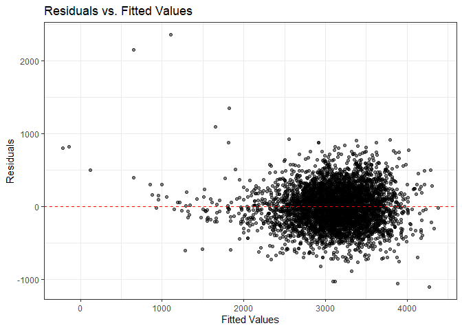<!-- -->

- I first fit an initial full regression model including all potential
  predictors listed. Then I applied a stepwise regression approach with
  both direction to select a set of variables that contribute
  meaningfully to the model according to AIC. I drew a residual vs. fit
  plot, which indicates that the stepwise model’s residuals spread
  randomly around the horizontal line at 0 (the red dashed line) and
  have no pattern. But I detected assumption violation of
  heteroscedasticity and some potential influential outliers. So, I
  tried to conducted other model diagnostics to see if I inappropriately
  include or miss some variables.

# check multicollinearity

``` r
vif_results = vif(stepwise_model) 
print(vif_results)
```

    ##             GVIF Df GVIF^(1/(2*Df))
    ## babysex 1.045505  1        1.022499
    ## bhead   1.826019  1        1.351303
    ## blength 1.769732  1        1.330313
    ## delwt   4.437162  1        2.106457
    ## fincome 1.205999  1        1.098180
    ## gaweeks 1.245075  1        1.115829
    ## mheight 1.315871  1        1.147114
    ## mrace   1.439897  3        1.062646
    ## parity  1.008629  1        1.004305
    ## ppwt    4.345209  1        2.084516
    ## smoken  1.101300  1        1.049428

``` r
# get the original bw
bw_numeric = bw |> select(-frace,-mrace,-babysex,-malform,-bwt)
corr_matrix = cor(bw_numeric) 
print(corr_matrix)
```

    ##                 bhead     blength        delwt      fincome       gaweeks
    ## bhead     1.000000000  0.63045480  0.214370719  0.115699146  0.3784564882
    ## blength   0.630454800  1.00000000  0.229149444  0.078745057  0.3592636747
    ## delwt     0.214370719  0.22914944  1.000000000  0.034994354  0.1242784648
    ## fincome   0.115699146  0.07874506  0.034994354  1.000000000  0.1066776727
    ## gaweeks   0.378456488  0.35926367  0.124278465  0.106677673  1.0000000000
    ## menarche -0.003016051 -0.02106739 -0.085940103 -0.003535085 -0.0004362693
    ## mheight   0.116948174  0.16025985  0.411257622  0.131018596  0.0621377387
    ## momage    0.108081296  0.08016031  0.074040925  0.323114207  0.1139098271
    ## parity   -0.020039523 -0.03247008 -0.004709123 -0.025942406 -0.0796588545
    ## pnumlbw            NA          NA           NA           NA            NA
    ## pnumsga            NA          NA           NA           NA            NA
    ## ppbmi     0.086556495  0.07401577  0.720504055 -0.020189000  0.0273358740
    ## ppwt      0.136608829  0.14860464  0.870913274  0.047252637  0.0564730379
    ## smoken   -0.053947231 -0.06562883  0.048612734  0.077943047  0.0362116820
    ## wtgain    0.183333740  0.19122376  0.424788310 -0.016037706  0.1481459581
    ##               menarche     mheight      momage       parity pnumlbw pnumsga
    ## bhead    -0.0030160515  0.11694817  0.10808130 -0.020039523      NA      NA
    ## blength  -0.0210673863  0.16025985  0.08016031 -0.032470081      NA      NA
    ## delwt    -0.0859401032  0.41125762  0.07404092 -0.004709123      NA      NA
    ## fincome  -0.0035350852  0.13101860  0.32311421 -0.025942406      NA      NA
    ## gaweeks  -0.0004362693  0.06213774  0.11390983 -0.079658854      NA      NA
    ## menarche  1.0000000000  0.07411557  0.17603797  0.019476194      NA      NA
    ## mheight   0.0741155687  1.00000000  0.10904804 -0.013423739      NA      NA
    ## momage    0.1760379749  0.10904804  1.00000000  0.051954243      NA      NA
    ## parity    0.0194761938 -0.01342374  0.05195424  1.000000000      NA      NA
    ## pnumlbw             NA          NA          NA           NA       1      NA
    ## pnumsga             NA          NA          NA           NA      NA       1
    ## ppbmi    -0.1218260802 -0.10073775  0.08124512 -0.005926674      NA      NA
    ## ppwt     -0.0704995875  0.42668724  0.12959210 -0.011202947      NA      NA
    ## smoken    0.0163746450  0.06098352  0.07545435 -0.005575698      NA      NA
    ## wtgain   -0.0445137226  0.04847893 -0.08848760  0.011081927      NA      NA
    ##                 ppbmi        ppwt       smoken      wtgain
    ## bhead     0.086556495  0.13660883 -0.053947231  0.18333374
    ## blength   0.074015773  0.14860464 -0.065628829  0.19122376
    ## delwt     0.720504055  0.87091327  0.048612734  0.42478831
    ## fincome  -0.020189000  0.04725264  0.077943047 -0.01603771
    ## gaweeks   0.027335874  0.05647304  0.036211682  0.14814596
    ## menarche -0.121826080 -0.07049959  0.016374645 -0.04451372
    ## mheight  -0.100737749  0.42668724  0.060983516  0.04847893
    ## momage    0.081245123  0.12959210  0.075454350 -0.08848760
    ## parity   -0.005926674 -0.01120295 -0.005575698  0.01108193
    ## pnumlbw            NA          NA           NA          NA
    ## pnumsga            NA          NA           NA          NA
    ## ppbmi     1.000000000  0.85331676  0.007022980 -0.10992958
    ## ppwt      0.853316763  1.00000000  0.038854748 -0.07494032
    ## smoken    0.007022980  0.03885475  1.000000000  0.02706577
    ## wtgain   -0.109929577 -0.07494032  0.027065774  1.00000000

``` r
#delwt and ppwt have high correlation; bhead and blength have high correlation;pnumlbw and pnumsga are all "0" value and should be excluded in models.
```

- Acorrding to the results of VIF analysis,correlation analysis and my
  knowlege, there’s relationship between bhead and blength,delwt and
  ppwt. I would like to keep bhead and ppwt in my model and delete the
  other two covariates.

## modify the model based on my knowledge

``` r
my_model = update(stepwise_model, . ~ . - blength - delwt)
summary(my_model)
```

## model diagnostics 2

``` r
# remember to rerun previous code chunk `clean_data` to get the original bw dataframe

# Add predictions and residuals to the data
bw_diagnostic2 = bw |>
  add_predictions(my_model) |>
  add_residuals(my_model)

# Plot model residuals against fitted values
bw_diagnostic2 |> ggplot( aes(x = pred, y = resid)) +
  geom_point(alpha = 0.5) +
  theme_bw() +
  labs(
    x = "Fitted Values",
    y = "Residuals",
    title = "Residuals vs. Fitted Values"
  ) +
  geom_hline(yintercept = 0, linetype = "dashed", color = "red")
```

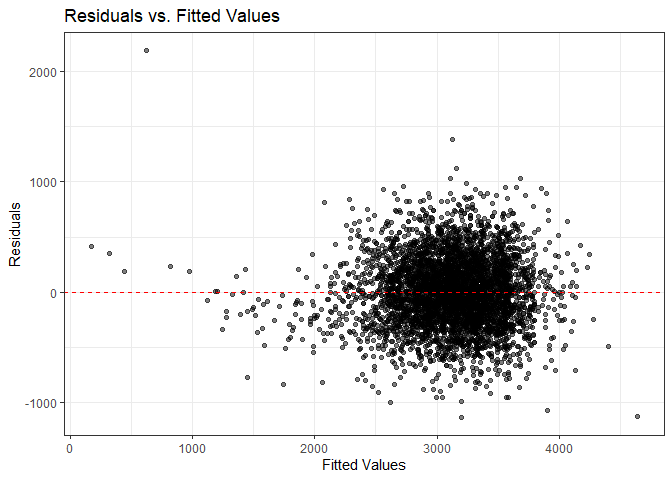<!-- -->

- According to the plot, this model seems good with no violation of
  assumption, but still have some outliers/influential points.

## identify potential outliers or influential points

``` r
influencePlot(my_model)
```

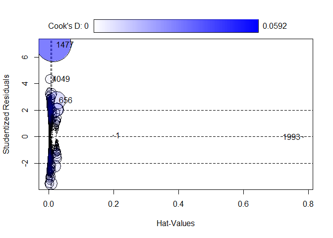<!-- -->

    ##          StudRes         Hat        CookD
    ## 1     0.08093817 0.198053417 0.0001348534
    ## 656   2.74537852 0.023878345 0.0153415178
    ## 1477  6.95885043 0.014607858 0.0591752786
    ## 1993 -0.02054817 0.783361993 0.0001272604
    ## 4049  4.35823426 0.002651333 0.0041904061

- According to studentized residual(absolute StudRes \> 2), point 656,
  1477, 4049 are outliers.

- According to leverage/Hat value(\>3\*(p/n)=0.0083),point
  1,656,1477,1993 have extrme x values.

- According to Cook’s distance(D(i) \> 4/n=0.001 not a cutoff), 656,
  1477 and 4049 point have larger CookD,more likely to be influential
  but still\<0.5.

- Outliers: Observations 656, 1477 and 4049 are likely outliers.

- Influential Points: Observations 656 and 1477 are likely influential
  due to their high Cook’s distances. Observation 1993 could also be
  influential due to its very high leverage, even though it’s not an
  outlier by the residual criterion.

## remove point 656, 1477, 4049 and 2463 from the observations

``` r
# remember to rerun previous code chunk `clean_data` to get the original bw dataframe
bw = bw[-c(656,1477,4049),]

full_model = lm(bwt ~ ., data = bw)
stepwise_model = step(full_model, direction = "both")
my_model = update(stepwise_model, . ~ . - blength - delwt)
summary(my_model)

influencePlot(my_model)
```

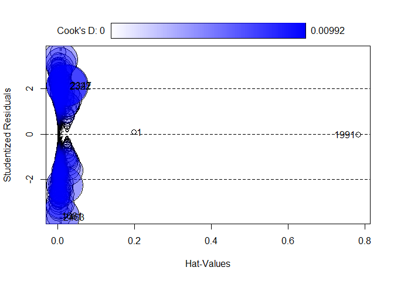<!-- -->

``` r
bw = bw[-c(2463),]
```

## model diagnostics 3

``` r
# remember to rerun previous code chunk `clean_data` to get the original bw dataframe

# Add predictions and residuals to the data
bw_diagnostic3 = bw |>
  add_predictions(my_model) |>
  add_residuals(my_model)

# Plot model residuals against fitted values
bw_diagnostic3 |> ggplot( aes(x = pred, y = resid)) +
  geom_point(alpha = 0.5) +
  theme_bw() +
  labs(
    x = "Fitted Values",
    y = "Residuals",
    title = "Residuals vs. Fitted Values"
  ) +
  geom_hline(yintercept = 0, linetype = "dashed", color = "red")
```

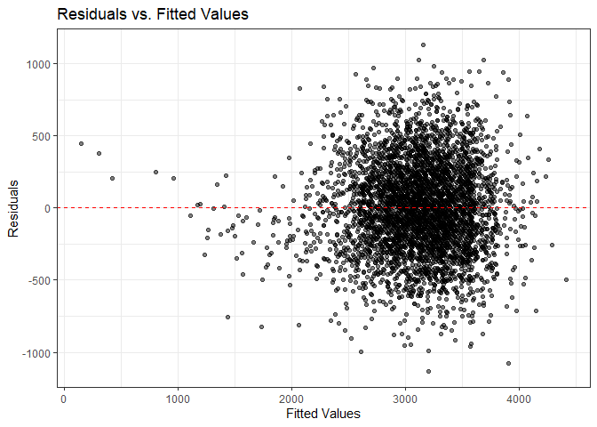<!-- -->

``` r
residuals = resid(my_model)
hist(residuals)# residual is normally-distributed
```

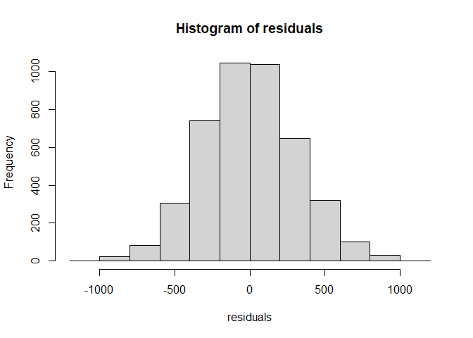<!-- -->

- Although there’s still influential outliers, I won’t remove them any
  longer.(removing point 2689 didn’t change the model so much)

## model comparison

I used original bw dataframe here. But I will use the dw after deleting
influential points for further comparison.

### split bw for 100-fold cross-validation

``` r
set.seed(123) # for reproducibility
folds = crossv_mc(bw, 100) # for 100-fold cross-validation
```

### my_model

``` r
# given a dataframe and a formula, return a model
fn_model = function(df){
  lm(bwt ~ babysex + bhead + fincome + gaweeks + mheight + mrace + parity + ppwt + smoken, data = df)
}

# get models for all resamples in train dataset 
folds_my_model =
  folds |>
  mutate(model = map(train, fn_model))


# calculate pre, resp,resid
sample_prediction = function(model, sample){
  df = as.data.frame(sample)
  pred = stats::predict(model, df)
}

sample_response = function(model, sample){
  df = as.data.frame(sample)
  var_response = all.vars(formula(model))[[1]]
  df[[var_response]]
}

####### those two functions above can be used repeatedly

folds_my_resid = 
  folds_my_model |>
  gather(key = split, value = data, train, test) |>
  mutate(
    pred = map2(model, data, sample_prediction),
    resp = map2(model, data, sample_response),
    resid = map2(pred, resp, `-`)
  ) |>
  select(.id, split, pred, resp, resid) |>
  unnest(cols = c(pred, resp, resid))

# calculate rmse
folds_my_rmse = 
  folds_my_resid |>
  group_by(.id, split) |>
  summarize(
    rmse = sqrt(sum(resid*resid)/length(resid))
  ) |>
  ungroup()
```

    ## `summarise()` has grouped output by '.id'. You can override using the `.groups`
    ## argument.

### model1

``` r
# given a dataframe, return a model
fn_model = function(df){
  lm(bwt ~ blength + gaweeks, data = df)
}

# get models for all resamples using train datasets
folds_model1 =
  folds |>
  mutate(model = map(train, fn_model))


folds_one_resid = 
  folds_model1 |>
  gather(key = split, value = data, train, test) |>
  mutate(
    pred = map2(model, data, sample_prediction),
    resp = map2(model, data, sample_response),
    resid = map2(pred, resp, `-`)
  ) |>
  select(.id, split, pred, resp, resid) |>
  unnest(cols = c(pred, resp, resid))

# calculate rmse
folds_one_rmse = 
  folds_one_resid |>
  group_by(.id, split) |>
  summarize(
    rmse = sqrt(sum(resid*resid)/length(resid))
  ) |>
  ungroup()
```

### model 2

``` r
# given a dataframe, return a model
fn_model = function(df){
  lm(bwt ~ bhead * blength * babysex, data = df)
}

# get models for all resamples using train datasets
folds_model2 =
  folds |>
  mutate(model = map(train, fn_model))


folds_two_resid = 
  folds_model2 |>
  gather(key = split, value = data, train, test) |>
  mutate(
    pred = map2(model, data, sample_prediction),
    resp = map2(model, data, sample_response),
    resid = map2(pred, resp, `-`)
  ) |>
  select(.id, split, pred, resp, resid) |>
  unnest(cols = c(pred, resp, resid))

# calculate rmse
folds_two_rmse = 
  folds_two_resid |>
  group_by(.id, split) |>
  summarize(
    rmse = sqrt(sum(resid*resid)/length(resid))
  ) |>
  ungroup() 
```

### combine the three datasets together to visualize the differences

The thing we are interested to do is to compare the performance of
models on their trianing sets with their proformance on their test sets.
One way we can do this is to make qualitative assesments of the kernel
density of the residuals.

``` r
resid = bind_rows(my_model = folds_my_resid, model1 = folds_one_resid, model2 = folds_two_resid,.id = "model") 

ggplot(resid, aes(x = resid, color = split, group = paste(split, .id))) +
  stat_density(
    aes(y = ..density..), 
    geom = "line", 
    position = "identity",
    alpha = 0.3
  ) + facet_grid(.~model) +
  guides(color = guide_legend(override.aes = list(alpha = 1))) +
  ggtitle("Kernel-density plot for each model by train and test data") +
  xlab("Residual") + ylab("Density")
```

    ## Warning: The dot-dot notation (`..density..`) was deprecated in ggplot2 3.4.0.
    ## ℹ Please use `after_stat(density)` instead.
    ## This warning is displayed once every 8 hours.
    ## Call `lifecycle::last_lifecycle_warnings()` to see where this warning was
    ## generated.

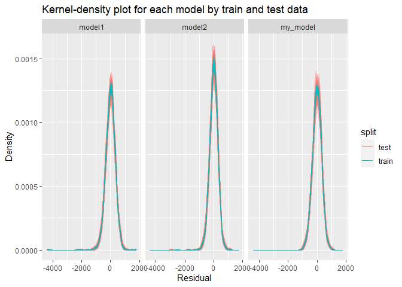<!-- -->

- The kernel-density estimates for the training residuals and the test
  residuals of the three models seem consistent one to another,
  indicating they

For regression problems, We can also use the RMSE because it gives us a
useful first idea of how a given model performs, and it is expressed in
the same units as the response.

``` r
rmse = bind_rows(my_model = folds_my_rmse, model1 = folds_one_rmse, model2 = folds_two_rmse,.id = "model")

rmse |> 
  ggplot(aes(x = model, y = rmse)) + geom_violin() +
  ggtitle("Violoin plot of RMSE for three models")
```

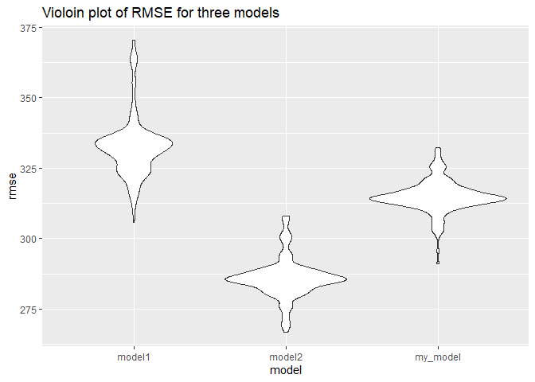<!-- -->

``` r
rmse |>
  ggplot(aes(x = model, y = rmse, color = split, group = split)) +
  stat_summary(geom = "line", fun = "median") +
  geom_point(
    position = position_jitterdodge(jitter.width = 0.2, dodge.width = 0.5),
    alpha = 0.5
  ) +
  ylim(0, NA) +
  guides(color = guide_legend(override.aes = list(alpha = 1))) +
  ggtitle("RMSE for each model by train and test data")
```

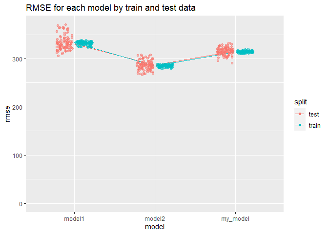<!-- -->

- For the violin plot, the RMSE is highest for model1 and the
  whisker-like shape suggests more extreme points.model 2 appears to
  have the lowest median RMSE, suggesting that it generally has the best
  fit out of the three models. However, model2 is too complex with many
  three-way interactions. The shape of violin shows the kernel density
  estimation of the RMSE for the respective model.

- For the plot showing RMSE for different models by training and testing
  data, the proximity of training and testing RMSE for each model
  indicates how well the model generalizes. model1 performs well on the
  training data but poorly on the testing data, indicating overfitting.
  my_model is best on this point.Although the thickness across scale
  indicates that my_model has a higher model variability, I would chose
  my_model as the final linear regression model, considering a balance
  between predicative accuracy and model complexity.
